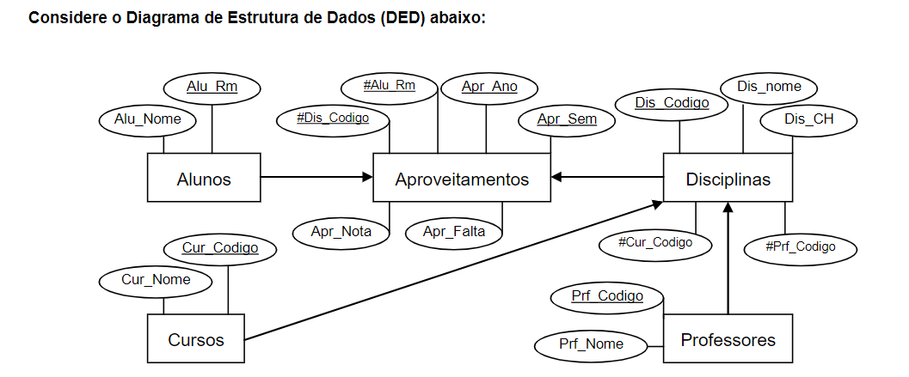

# Banco de Dados I
Matéria relacionada a lógica e sintaxe de banco de dados SQL (Modelagem e criação de banco)

## 08/02/2024 - 20/02/2024 | Introdução
Tipos de Buscas:
 - Busca Sequencial é aquela busca que é feita sequencialmente (1 por 1)
 - Busca Indexada é aquela busca que é feita atráves do índice (em banco utilizamos primary key dando um índice à linha)

O que é um Banco de Dados?
R: É um conjunto de informações organizadas que permita uma busca rápida (consultar).

O que é um Banco SGBD?
R: É um sistema gerenciador de banco de dados que é obrigatório ter algumas funções como Backup/Restore/Gerenciamento de Usuários/Permissões/Acessos/Transação e Concorrência (se instalada em qualquer máquina, a máquina passa a ser um servidor).
Exemplo de SGBDS: Oracle, SQLServer, PostgresSQL.

O que é um Banco SBD?
R: É o conjunto de bancos SGBD.

O que é um Metadado?
R: São as informações que podemos dar para o dado, exemplo data, nome, etc...

O que é um Modelo de Dados?
R: É a forma na qual o dado é armazenado, sendo utilizados os seguintes modelos:
- Bancos Relacionais: são modelos de dados que não suportam imagens, e permitem a ordenação dos metadados (relação de ordem), orientado a tabelas (exemplo, SQLServer, PostgreSQL, etc...)
- Bancos não Relacionais: são modelos de dados que suportam imagens e não permitem a ordenação dos metadados (exemplo, Cassandra, MongoDB, etc...)

Criando uma tabela de exemplo para os departamentos de uma empresa:
```
CREATE TABLE Departamentos
(
    cod INT NOT NULL PRIMARY KEY,
    descricao VARCHAR(50) NOT NULL
)
```
Criando uma tabela de exemplo para funcionários de uma empresa e relacionando os mesmos com os departamentos:
```
CREATE TABLE Funcionarios
(
    cod INT NOT NULL PRIMARY KEY,
    nome VARCHAR(100) NOT NULL,
    salario DECIMAL(10,2),
    dep_cod INT NOT NULL REFERENCE Departamentos
)
```
Toda chave estrangeira necessita estar conectado à uma chave primária?
R: Sim, porque os elementos são únicos e garante que as informações virão do lugar correto, dando nome à Intregridade Referencial, onde o modelo de dados relacionais garante que o valor tem que ser íntegro(existente) e estar referido em outro lugar.

O que é Modelo Conceitual?
R: O Modelo Conceitual serve para traduzir o mundo real para base de dados, incluindo entidades que são os itens que contém registros, exemplo:
Um departamento é uma entidade que contém inúmeras descrições, isso traduz o mundo real para um modelo conceitual onde serão armazenados os dados de uma empresa a partir de departamentos.

Um banco de dados segue a seguinte estrutura:
MC -> Modelo Conceitual(define o mundo real) -> Modelo Lógico(define o modelo de dados) -> Modelo Físico(DDL) -> Banco de Dados

## 22/02/2024 - Cardinalidade
O que é Cardinalidade?
R: É o número de vezes que um item se comunica com outro item, exemplo: 1 único funcionário pode-se comunicar com 1 departamento porém 1 departamento pode-se comunicar com vários funcionários.

## 27/02/2024 - Criação do Primeiro Banco de Dados
Nessa aula fizemos a criação do primeiro banco de dados, visualizar em ```/utils/primeiro-banco```

## 29/02 - 05/03/2024 | Exercício de Herança
Para saber a herança tem que fazer uma pergunta: É um(a)?


== Entidades:
Pedidos: Data, Valor e Status

Clientes: Nome, CPF, Status, Venda e Credito

Vendedor: Nome, CPF, Status, Salario

Produtos: Descrição, Valor, Estoque e Status

Finalizando o projeto visto em sala de aula

Visualizar projeto DB em ```utils/exercicio-1```

Quais são as restrições de banco de dados?
- **UNIQUE CONSTRAINT:** restrição de valor único (não vai ter 2 cpfs iguais)
- **PRIMARY KEY:** garante que cada linha em uma tabela seja única, identificando exclusivamente cada registro.
- **FOREIGN KEY:** estabelece uma relação entre duas tabelas, garantindo que os valores em uma coluna correspondam aos valores de outra tabela.
- **CHECK CONSTRAINT:** define uma condição que os valores em uma coluna devem satisfazer, usada para garantir que os dados atendam conjunto específico de critéorios.
- **NOT NULL CONSTRAINT:** impede que os valores em uma coluna sejam nulos.
- **DEFAULT CONSTRAINT:** define um valor padrão para uma coluna caso nenhum valor seja especificado durante a inserção de dados.
- **INDEX CONSTRAINT:** cria índices em colunas específicas para acelerar a recuperação de dados.

## 07/03/2023 | Aula com Arquivo Disponível no Aluno Online
Possível visualizar o arquivo em ````/utils/Vendas_CCO```

O que é uma procedure?
R: Procedure é um procedimento armazenado no banco que serve para otimizar tempo, exemplo procedure de create, update, delete, etc...

O que são parâmetros?
R: São variáveis locais no qual o valor vem de fora.

Como diferenciar @ e @@?
R: Somente @ significa que é uma variável do usuário alimentada pelo menos, enquanto @@ significa uma variável alimentada pelo SQL.

O seguinte insert pega a última chave primária gerada pelo SQL e da um insert na tabela de clientes a partir dessa chave: 
```	INSERT INTO clientes values (@@IDENTITY, @renda, @renda*0.25)```

## 12/03/2024 | Trabalho

Exercício proposto:


Rascunho do trabalho:


## 14/03/2024 - 21/03/2024
Trabalho de banco de especialidades

Possível visualizar em ```/utils/locacao_cco```

## 26/03/2024 
se o item for primária e estrangeira (filha de alguém)

composta -M mais de uma coluna entra na chave

## 07/05/2024
Segunda prova de banco:
Diagrama que estará na prova:


Foi feito uma lista de exercícios (já respondida) que será utilizada para fazer a prova (tudo o que tem lá, terá na prova)
A lista poderá ser encontrada em ```/utils/enunciados```

Iniciando os primeiros exercícios:
O seguinte select pega a media com o "AVG", que é uma função do banco de dados que faz a media automaticamente (average):
```select AVG(apr_nota) Media from aproveitamentos ```

O seguinte select pega a media com o "AVG", que é uma função do banco de dados que faz a media automaticamente (average), utiliza o COUNT com asteriscos para contar as linhas que foram lidas:
```select AVG(apr_nota) Media, COUNT(*) qtd from aproveitamentos where alu_rm = 1```

O seguinte select pega a media com o "AVG", conta a quantidade de linhas, pega a nota maxima e a nota menor:
```select AVG(apr_nota) Media, COUNT(*) Qtd, MAX(apr_nota) Maior, MIN(apr_nota) Menor from aproveitamentos where alu_rm = 1```

O seguinte select agrupa os alunos para separar as colunas de cada um:
```select AVG(apr_nota) Media, COUNT(*) Qtd, MAX(apr_nota) Maior, MIN(apr_nota) Menor from aproveitamentos where alu_rm = 1 OR alu_rm = 4 group by alu_rm```

O seguinte select agrupa os alunos para separar as colunas de cada um (OBS: Só pode incluir no select o que tem dentro do group by)
```select alu_rm, AVG(apr_nota) Media, COUNT(*) Qtd, MAX(apr_nota) Maior, MIN(apr_nota) Menor from aproveitamentos where alu_rm = 1 OR alu_rm = 4 group by alu_rm``


O seguinte select faz as mesmas coisas que o select de cima porém utilizando uma condição com o "HAVING", exibindo somente os alunos com media maior que 7 (OBS: Não pode usar WHERE porque não funciona)
```select alu_rm RM, AVG(apr_nota) Media, COUNT(*) Qtd, MAX(apr_nota) Maior, MIN(apr_nota) Menor from aproveitamentos group by alu_rm having AVG(apr_nota) > 7```

OBS: Dentro do WHERE nunca deverá ser colocado funções do banco de dados.
`
O seguinte select converte as casas decimais:
```select alu_rm RM, convert(decimal(4,2), AVG(apr_nota)) Media, COUNT(*) Qtd, MAX(apr_nota) Maior, MIN(apr_nota) Menor from aproveitamentos where apr_nota > 3 group by alu_rm having AVG(apr_nota) > 8.25```

```select al.alu_rm, al.alu_nome Nome, convert(decimal(4,2), AVG(apr_nota)) Media, COUNT() Qtd, MAX(apr_nota) Maior, min(apr_nota) Menor from aproveitamentos ap, alunos al where apr_nota > 3 and ap.alu_rm = al.alu_rm group by al.alu_rm, al.alu_nome having AVG(apr_nota) > 8 and count() > 7 order by Media desc```