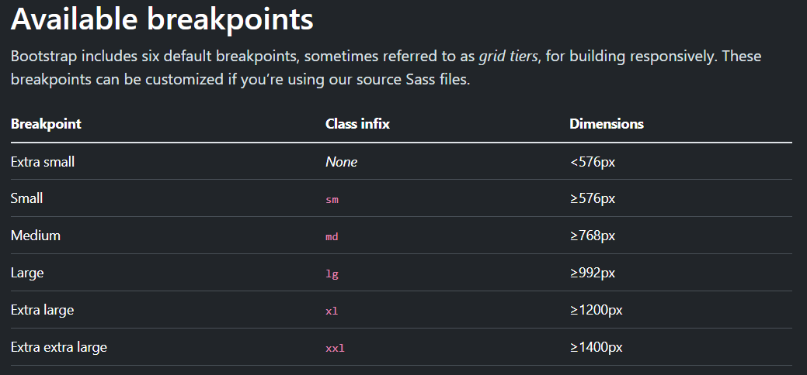

# Linguagem de Programação II
A segunda parte da matéria que engloba a criação de sites com Razor, C# no Back-end e SQLServer.

Nesse projeto será encontrado mais prática do que teoria.

## 05/02/2024 - E-Commerce
Começamos a aula retomando o projeto de E-Commerce, ele pode ser encontrado em ´´/code/Ecommerce´´

## 19/02/2024 - Programação para Web
O que é desenvolvimento para WEB?
R: É a área de desenvolvimento focado aplicações/sites/softwares que rodam na WEB (HTTP), essas aplicações rodam com base em:
- Intranet: É uma conexão que funciona em uma rede configurada localmente.
- Extranet: É uma conexão que funciona em uma rede configurada localmente porém restrito a um número de pessoas que acessam a conexão a partir de VPN, Remote Desktop, Tunnel (acessa de fora do local configurado).
- Internet: É uma conexão que funciona em redes diferentes, sem necessidade de uma configuração local, acessa inúmeros locais ao mesmo tempo (a rede mundial de computadores).

O que é WWW?
R: É a World-Wide-Web, interface gráfica da WEB, sua idéia básica é criar um mundo de informações sem fronteiras, prevendo as seguintes características:
- Interface consistente
- Incorporação de um vasto conjunto de tecnologias e tipos de documentos   
- Leitura universal

Além disso, ele implementa três ferramentas importantes, sendo elas:
- Protocolo de transmissão de dados sendo o HTTP (HYPER TEXT TRANSFER PROTOCOL)
- Um sistema de endereçamento próprio sendo a URL (UNIFORM RESOURCE LOCATOR) que é formado pela sintaxe da URI (UNIVERSAL RESOURCE IDENTIFIER)
- Uma linguagem de marcação para transmitir documentos formatados pelo HTML (HYPER TEXT MARKING LANGUAGE)

```
Exemplo de HTTP: 
http(sendo o protrocolo, caso for com 's' é porque o site tem o certificado SSL)://www.idosystems.com.br(sendo o nome da maquina)/site(sendo as pastas e subpastas)/index.html(sendo o arquivo)
```

## 26/02/2024 - Primeiro Projeto em HTML
Possível visualizar em ```utils/projeto-1/index.html```

## 25/03/2024 - Primeiro Projeto utilizando Bootstrap
Possível visualizar em ```utils/projeto-3/index.html```

Porque estamos utilizando o bootstrap online e não instalavel?
R: Otimiza espaço no servidor onde a aplicação está instalada.




